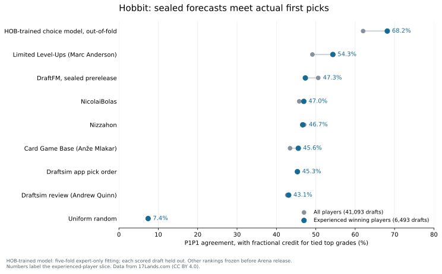

# Hobbit: the prerelease forecast meets real drafts

Factual working note, 2026-09-20. Results are local and have not been published.

The sealed DraftFM ranking agreed with 47.34% of experienced winning players’ first picks. Limited Level-Ups’ saved review reached 54.33% on the same packs. A separate model fitted after release to HOB first picks reached 68.15% out of fold.

Limited Level-Ups led DraftFM by 6.99 percentage points (paired 95% interval: 5.54–8.38). That is about seven additional matching first picks per 100 packs under the tie-breaking rule below. This is a meaningful advantage on the primary evaluation.

The prerelease model transferred useful preferences to an unseen set, but it did not match the strongest saved human review or the model trained on HOB data. It was close to Nizzahon and NicolaiBolas under this metric, and ahead of Card Game Base and the two Draftsim forecasts. Those statements describe agreement with observed picks, not win rates or optimal decisions.



The main table uses **6,493 experienced-player drafts** and **41,093 drafts from all players**. Every predictor is scored on identical packs within each column. Experienced means the existing paper’s win-rate bucket >= 0.55 and games-played bucket >= 100.

| Predictor | Experienced players | All players |
|---|---:|---:|
| HOB-trained choice model, out-of-fold | 68.15% | 62.01% |
| Limited Level-Ups (Marc Anderson) | 54.33% | 49.13% |
| DraftFM, sealed prerelease | 47.34% | 50.61% |
| NicolaiBolas | 46.95% | 45.78% |
| Nizzahon | 46.67% | 47.04% |
| Card Game Base (Anže Mlakar) | 45.56% | 43.45% |
| Draftsim app pick order | 45.32% | 45.35% |
| Draftsim review (Andrew Quinn) | 43.11% | 42.75% |
| Uniform random | 7.42% | 7.42% |

The all-player column tells a different story: DraftFM leads every saved full-coverage prerelease comparator there, including Limited Level-Ups. The experienced-player column is the primary comparison because it matches the forecast’s intended skill condition. The broader column is reported rather than choosing whichever population looks best.

**Paired differences on experienced-player packs.** Positive numbers favor DraftFM. Intervals are 95% percentile intervals from 2,000 paired draft resamples, seed 17. They are marginal, with no correction for multiple comparisons.

| Comparator | DraftFM minus comparator (percentage points) | 95% interval |
|---|---:|---:|
| Card Game Base (Anže Mlakar) | +1.79 | [+0.51, +3.03] |
| Draftsim app pick order | +2.02 | [+0.82, +3.26] |
| Draftsim review (Andrew Quinn) | +4.23 | [+3.10, +5.43] |
| Limited Level-Ups (Marc Anderson) | -6.99 | [-8.38, -5.54] |
| NicolaiBolas | +0.39 | [-0.84, +1.64] |
| Nizzahon | +0.67 | [-0.35, +1.62] |
| HOB-trained choice model | -20.81 | [-22.09, -19.47] |

The intervals against Nizzahon and NicolaiBolas cross zero; that is not an equivalence test. The advantage for Limited Level-Ups and the gap to the HOB-trained model are substantial under this analysis.

**How a ranking makes a first pick.** Within each offered pack, choose the highest-rated non-basic card. DraftFM uses the raw score in the original sealed CSV, with no rerun or refit. Letter forecasts use their original 13-level ordinal grades, slash grades use the first grade, and numeric forecasts retain their original values. Basics are excluded consistently. If k cards tie for best, the forecast receives 1/k credit when the human picked one of those cards. This is expected accuracy under uniform tie-breaking, not a favorable alphabetical tie-break.

For perspective, if any tied-best card instead counted as a full success, Limited Level-Ups would score 62.88% and DraftFM would remain at 47.34%. The complete tie-inclusive results and mean tie sizes are in the [shared-pack table](results/hob_oos_20260920/shared_p1p1.csv). Coarse letter scales contain less ordering information, so this measures the archived forecasts, not the reviewers’ full drafting ability.

**Coverage and exclusions.** The frozen public snapshot contains 1,833,289 pick rows and 43,650 distinct P1P1 drafts, of which 6,902 meet the expert thresholds. Its drafts run from 2026-08-11 15:43:42 through 2026-08-29 23:59:58 (source timestamps). The dump was retrieved on September 19; it is not a September 19 playthrough sample.

Limited Level-Ups marked The Black Arrow “SB.” Its 2,557 packs (409 expert packs) are excluded from the shared comparison because that source gives no main-deck rank for an offered card. All other full-coverage sources can also be compared with DraftFM on all 43,650 drafts (6,902 experts); those larger pairwise populations are preserved in [pairwise_p1p1.csv](results/hob_oos_20260920/pairwise_p1p1.csv). None of the observed P1P1 selections was a basic or an unknown card.

The archived Limited Resources review covers only 120 commons and uncommons. It covers every offered non-basic card in zero P1P1 packs, so it has no comparable full-pack accuracy row. We did not remove ungraded rare choices to manufacture a comparison.

**The post-release reference model.** It learns 188 card values from expert P1P1 choices, minimizing masked multinomial negative log likelihood plus a fixed unit ridge penalty. Five folds are assigned by CRC32 of draft ID. Each fit uses expert drafts from four folds and predicts only the other fold: no scored draft appears in its own fit. Each fit starts at zero, uses L-BFGS-B, and converged in 42–45 iterations. The recipe was fixed before its results were computed, but after seeing the initial creator comparison; this is an exploratory addendum.

The fits used 5,494–5,548 training expert drafts apiece. Their training-set agreement ranged from 68.37% to 69.27%; those are in-sample diagnostics, not the headline result. No hyperparameter search or selection among fitted models was performed.

This benchmark has access to post-release behavior and is not a prerelease competitor, a theoretical ceiling, or a full draft agent. Random folds mix dates rather than forecast the future. Its paired intervals condition on the fitted predictions and do not include training variance or dependence from overlapping training folds. Draft resampling also does not account for repeat appearances of the same player.

**Secondary outcome associations.** The separately cached ratings request covers August 11–September 19. Although it contains all 188 non-basic names, only 18 have both a non-null GIH win rate and at least 200 GIH observations; only 52 have a usable average-taken-at value with positive pick count. On the 18-card GIH subset DraftFM’s Spearman correlation is -0.232; on the 52-card negative-ATA subset it is 0.518. These small, selective subsets do not support a set-wide claim about predicting card win rates. Every computed creator comparison, including LR, is retained in [outcome_correlations.csv](results/hob_oos_20260920/outcome_correlations.csv). No causal card-strength interpretation is made.

**What was frozen, and when.** The [public forecast](https://github.com/brianward92/draftfm/tree/draftfm-v1.0) was sealed on August 9, before HOB’s August 11 Arena release. The downloaded public CSV was checked again against the local forecast and its published digest. Creator transcriptions are the archived pre-Arena snapshots, not live tier lists. Draftsim’s app date comes from an asset header, and NicolaiBolas’s archive records retrieval rather than a verified publication date; the original paper discusses those timestamp limits. This note publishes aggregate comparisons, not the underlying creator grade tables.

The [analysis rules](hob_out_of_sample_protocol_20260919.md) were written before calculating these results, but after release. The forecast is prospective; the detailed follow-up analysis is retrospective. The [fitted-model addendum](hob_postrelease_benchmark_protocol_20260920.md) records its later request and fixed recipe.

**Reproducibility.** Source hashes, retrieval metadata, population counts, exclusions, package versions, outputs, and paired intervals are saved in [forecast_summary.json](results/hob_oos_20260920/forecast_summary.json) and [fitted_summary.json](results/hob_oos_20260920/fitted_summary.json). The public aggregate files contain no individual draft rows. Local inputs remain under `data/forecast_20260919/inputs/`, and full private results under `data/forecast_20260919/hob/`.

| Input | SHA-256 |
|---|---|
| forecast | `a16c34767aa382e7703f480207f8480484e29ad22bbab2142aa2195e9b9a94a9` |
| grades | `2e67fa9276b0bf3cb87455c8916df1c56424c7c6ebd6ec83e66f2ba8d66bc40b` |
| drafts | `e4388244f7b0678f45b6c665126e54d9ec3e2c465d11be5b20a8faefd3e4015f` |
| ratings | `42219c98271aa9cac7c1a9a76968713fa54dc6f3182c656d5290ddfb787ef190` |
| protocol | `4a816a33b92b802592ebe7c66eb8546b1403968f3c061db8715435feda2df6f0` |

Install `requirements-forecast-eval.txt` in the analysis environment, then run:

```bash
PYTHONPATH=. .venv-embed/bin/python scripts/eval_hob_forecast.py \
  --forecast "$HOME/dat/mtga-draftfm-rebuild-20260808/seal/draftfm-v1.0/hob_p1p1_forecast.csv" \
  --grades data/external/creator_grades/creator_grades_hob.csv \
  --drafts data/forecast_20260919/inputs/draft_data_public.HOB.PremierDraft.csv.gz \
  --ratings data/forecast_20260919/inputs/hob_card_ratings_20260919.json \
  --protocol docs/hob_out_of_sample_protocol_20260919.md \
  --out-dir data/forecast_20260919/hob

PYTHONPATH=. .venv-embed/bin/python scripts/eval_hob_fitted_benchmark.py \
  --forecast "$HOME/dat/mtga-draftfm-rebuild-20260808/seal/draftfm-v1.0/hob_p1p1_forecast.csv" \
  --grades data/external/creator_grades/creator_grades_hob.csv \
  --drafts data/forecast_20260919/inputs/draft_data_public.HOB.PremierDraft.csv.gz \
  --protocol docs/hob_postrelease_benchmark_protocol_20260920.md \
  --out-dir data/forecast_20260919/hob/fitted_benchmark

PYTHONPATH=. .venv-embed/bin/python scripts/report_hob_forecast.py \
  --eval-dir data/forecast_20260919/hob \
  --out-dir docs/results/hob_oos_20260920 \
  --note docs/hob_out_of_sample_20260920.md
```

Exact reproduction requires the frozen raw snapshot and archived creator input with the hashes above; live downloads may have changed. The optional `--nicolai` flag is unnecessary here because the combined creator CSV already contains NicolaiBolas; duplicate source/card rows are deliberately rejected.

Data from 17Lands.com (CC BY 4.0). Card identities and descriptions from Scryfall. These are draft working results for an independent follow-up article, not a published update to the original paper.
